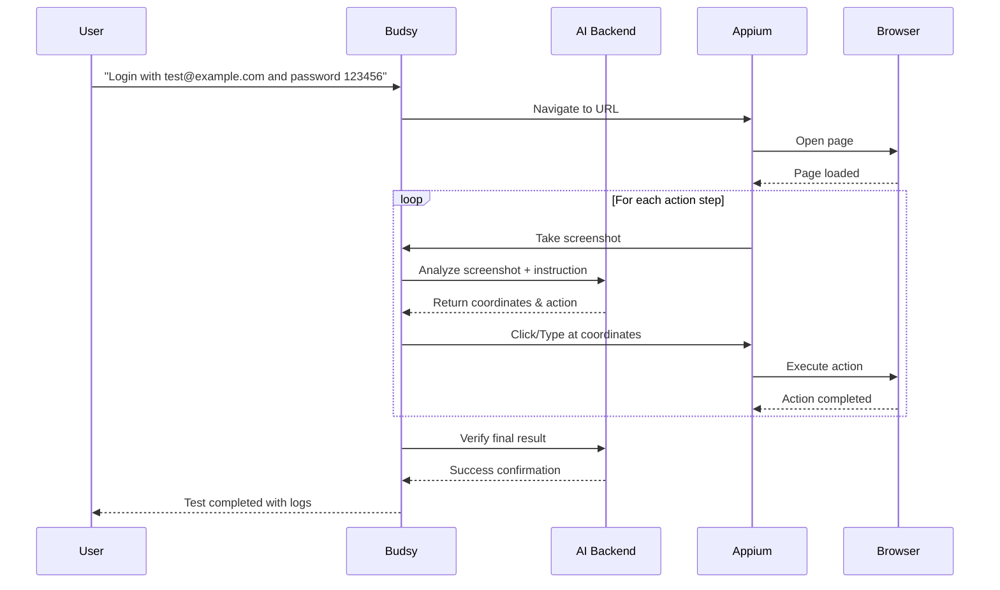

# Budsy Testing Agent 🤖

> **AI-Powered UI Testing Agent** - Seamlessly test web applications using natural language instructions with AI-guided screenshot analysis and coordinate-based actions.

[](https://nodejs.org/)
[](https://appium.io/)
[](LICENSE)

## 🎯 Perfect for Your Use Case

**"User wants to go to sign page, enter email and password, hit login, and land on dashboard"**

With Budsy, you simply:
1. **Provide the URL**: `https://your-app.com`
2. **Give natural instructions**: "Go to sign in page, enter email test@example.com and password 123456, click login button"  
3. **Let AI + Appium handle the rest**: Screenshots → AI analysis → Coordinate clicking → Action execution → Result verification

## ✨ Key Features

### 🧠 AI-Powered Testing
- **Visual Recognition**: AI analyzes screenshots to find elements (no CSS selectors needed!)
- **Natural Language**: Write tests in plain English
- **Smart Coordination**: AI determines exact pixel coordinates for clicking
- **Adaptive Actions**: Self-healing tests that adapt to UI changes

### 🚀 Multiple Testing Modes
- **Visual Testing**: AI analyzes screenshots and performs coordinate-based actions
- **Iterative Testing**: AI provides step-by-step feedback with learning loops
- **Traditional Testing**: CSS selector-based testing for stable applications

### 🌐 Multi-Platform Support
- **Web Browsers**: Chrome, Firefox, Safari, Edge
- **Android Apps**: Native and hybrid applications
- **iOS Apps**: Native applications with XCUITest

### 💻 Dual Interface
- **Command Line**: Interactive CLI and direct commands
- **Web Interface**: Real-time test monitoring with live logs and WebSocket updates

## 🏁 Quick Start

### Prerequisites
```bash
# Node.js 18+ required
node --version  # Should be 18.0.0+

# Install Appium globally
npm install -g appium

# Start Appium server (in separate terminal)
appium server
```

### Installation & Setup
```bash
# Clone repository
git clone <repository-url>
cd budsy-testing-agent

# Install dependencies
npm install

# Run interactive setup
npm run setup
```

The setup will guide you through:
- AI backend service configuration
- Appium server settings
- Browser preferences
- Screenshot and logging options

### Your First AI-Guided Test

#### Option 1: Web Interface (Recommended)
```bash
npm run web
# Open http://localhost:3000

# Fill in the form:
# - URL: https://your-app.com/login
# - Instruction: "Enter email test@example.com, password 123456, click login"
# - Click "Start AI-Guided Test"
# - Watch real-time logs as AI guides the test execution
```

#### Option 2: Command Line
```bash
# Interactive mode
npm start

# Direct command
npx budsy run \
  --url "https://your-app.com/login" \
  --instruction "Go to login page, enter email test@example.com and password 123456, click login button and verify dashboard appears"
```

## 🔧 How It Works

### AI-Guided Visual Testing Flow


### Example Test Flow
1. **Instruction**: "Go to sign in page, enter email test@example.com and password 123456, click login"

2. **AI Processing**:
   - Takes screenshot of current page
   - AI identifies sign-in elements
   - Generates action plan: navigate → enter email → enter password → click login

3. **Execution**:
   - **Step 1**: AI finds email input field at coordinates (150, 200) → Types email
   - **Step 2**: AI finds password field at coordinates (150, 250) → Types password  
   - **Step 3**: AI finds login button at coordinates (200, 300) → Clicks button
   - **Step 4**: AI verifies dashboard page appears

4. **Result**: Complete test execution with screenshots, logs, and verification

## 📁 Project Structure

```
budsy-testing-agent/
├── src/
│   ├── config/                 # Configuration management
│   ├── core/                   # Core testing components
│   │   ├── ai-client.js       # AI backend communication
│   │   ├── appium-driver.js   # WebDriver management
│   │   ├── logger.js          # Logging system
│   │   ├── test-executor.js   # Traditional testing
│   │   └── visual-test-executor.js # AI-guided testing
│   ├── web/                   # Web interface
│   │   ├── server.js          # Express + WebSocket server
│   │   └── static/            # Web UI files
│   └── index.js               # Main CLI entry point
├── scripts/
│   └── setup.js              # Interactive setup
├── documentation/             # Complete API documentation
└── package.json
```

## ⚙️ Configuration

### Environment Variables (.env)
```bash
# AI Backend Service
BACKEND_URL=http://localhost:8000
API_AUTH_KEY=your_api_key

# Appium Configuration  
APPIUM_SERVER_URL=http://localhost:4723
APPIUM_LOG_LEVEL=info

# Browser Settings
DEFAULT_BROWSER=chrome
BROWSER_WINDOW_WIDTH=1280
BROWSER_WINDOW_HEIGHT=720

# Screenshots & Logging
SCREENSHOT_DIR=./screenshots
SAVE_SCREENSHOTS=true
LOG_LEVEL=info
LOG_FILE=./logs/budsy.log
```

## 🎮 Usage Examples

### Web Interface Testing
Perfect for your use case - simple and visual:

```javascript
// Via Web UI at http://localhost:3000
URL: https://your-app.com/login
Instruction: "Go to sign in page, enter email user@domain.com and password secret123, click login button, verify dashboard appears"
Mode: Visual Testing (AI-guided)
```

### CLI Commands
```bash
# Health check
budsy health

# Configuration display  
budsy config

# Web interface
budsy web --port 3000

# Direct test execution
budsy run \
  --platform web \
  --url "https://example.com" \
  --instruction "Complete user registration with test data" \
  --expected "Registration success page appears"
```

### API Usage
```javascript
import VisualTestExecutor from './src/core/visual-test-executor.js';

const executor = new VisualTestExecutor();
await executor.initialize({ platform: 'web' });

const result = await executor.executeVisualTest(
  'Navigate to login page, enter credentials, and verify successful login',
  'https://your-app.com'
);

console.log(`Test ${result.success ? 'passed' : 'failed'}`);
console.log(`Steps executed: ${result.stepsExecuted}`);
console.log(`Duration: ${result.duration}ms`);
```

## 🔍 Testing Modes

### 1. Visual Testing (Recommended for your use case)
- **Best for**: Dynamic UIs, modern web apps, no reliable selectors
- **How**: AI analyzes screenshots and clicks precise coordinates
- **Benefits**: Works with any UI, self-healing, handles layout changes

```bash
budsy run --url "https://app.com" --instruction "Login and check dashboard" --mode visual
```

### 2. Iterative Testing
- **Best for**: Complex workflows, exploration testing
- **How**: AI provides step-by-step feedback and guidance
- **Benefits**: Adaptive testing, learns as it goes

### 3. Traditional Testing  
- **Best for**: Stable apps with reliable CSS selectors
- **How**: Uses standard WebDriver element finding
- **Benefits**: Fast execution, predictable behavior

## 📊 Real-Time Monitoring

### Web Interface Features
- **Live Test Execution**: Watch tests run in real-time
- **Interactive Logs**: Colored, searchable log stream
- **Health Monitoring**: AI backend, Appium server, and web server status
- **Download Logs**: ZIP archives with screenshots and execution details
- **Test Controls**: Start, stop, and monitor multiple test sessions

### Log Categories
- **🚀 Test Execution**: Test start/completion status
- **📸 Screenshots**: Image capture and analysis
- **🤖 AI Analysis**: Visual recognition and decision making
- **⚡ Actions**: Coordinate clicking, typing, scrolling
- **✅ Verification**: Result validation and confidence scores

## 🛠️ Advanced Features

### 🎯 Enhanced Coordinate Precision
- **Sub-pixel accurate clicking** with progressive targeting strategies
- **Viewport-aware coordinate adjustment** with safety zone validation
- **Smart element positioning** (center for buttons, 25% offset for inputs)
- **Bounding box optimization** with fallback coordinate generation
- **LLM backend validation** against screen bounds and browser chrome

### 📧 Advanced Email Input Handling  
- **5-strategy element detection** (direct, layered, child search, nearby, pattern matching)
- **Progressive click attempts** with coordinate offsets for better targeting
- **Multiple focus methods** for cross-browser compatibility
- **Enhanced field clearing** (4 different clearing strategies)
- **Character-by-character verification** with typing progress monitoring
- **Email format validation** and enhanced error recovery

### 🔄 Intelligent Error Recovery
- **Multi-attempt retry logic** with fresh screenshots between attempts
- **Alternative coordinate exploration** using AI-generated fallbacks
- **Confidence-based retry thresholds** (progressive from 0.8 to 0.5)
- **Scroll-based element discovery** when elements aren't initially visible
- **Comprehensive error logging** with LLM backend context and attempt details
- **Coordinate validation reporting** with specific failure analysis

## 📚 Documentation

Comprehensive documentation available in `/documentation/`:

- **[Setup Guide](documentation/scripts/setup.md)** - Project setup and configuration
- **[Configuration](documentation/src/config/index.md)** - Environment and settings management  
- **[AI Client](documentation/src/core/ai-client.md)** - AI backend communication
- **[Visual Test Executor](documentation/src/core/visual-test-executor.md)** - AI-guided testing engine
- **[Web Interface](documentation/src/web/server.md)** - Real-time web interface
- **[Complete API Reference](documentation/README.md)** - Full system documentation

## 🎯 Perfect For Your Use Case

**"Go to sign page, enter email and password, hit login, land on dashboard"**

✅ **Natural Language**: Write exactly what you want to test  
✅ **No Selectors**: AI finds elements visually  
✅ **Real-time Logs**: See exactly what's happening  
✅ **Screenshot Analysis**: AI understands your UI  
✅ **Coordinate Actions**: Precise clicking and typing  
✅ **Verification**: AI confirms success  

## 🚀 Getting Started Now

1. **Quick Setup**:
   ```bash
   npm install
   npm run setup  # Interactive configuration
   ```

2. **Start Web Interface**:
   ```bash
   npm run web
   # Open http://localhost:3000
   ```

3. **Create Your First Test**:
   - URL: Your login page
   - Instruction: "Enter email test@example.com and password 123456, click login"
   - Click "Start AI-Guided Test"
   - Watch the magic happen! 🎭

## 🤝 Support & Troubleshooting

### Common Issues
- **AI Backend**: Ensure your AI service is running and accessible
- **Appium Server**: Start with `appium server` in separate terminal
- **Browser Issues**: Check Chrome/Firefox installation and permissions
- **Screenshots**: Verify screenshot directory exists and is writable

### Health Check
```bash
budsy health  # Check all services status
```

### Logs Location
- **Application Logs**: `./logs/budsy.log`
- **Screenshots**: `./screenshots/`
- **Web Interface**: Download logs via UI

## 📄 License

MIT License - see [LICENSE](LICENSE) file for details.

---

**Ready to revolutionize your UI testing?** 🚀  
Start with `npm run setup` and experience AI-powered testing in minutes!