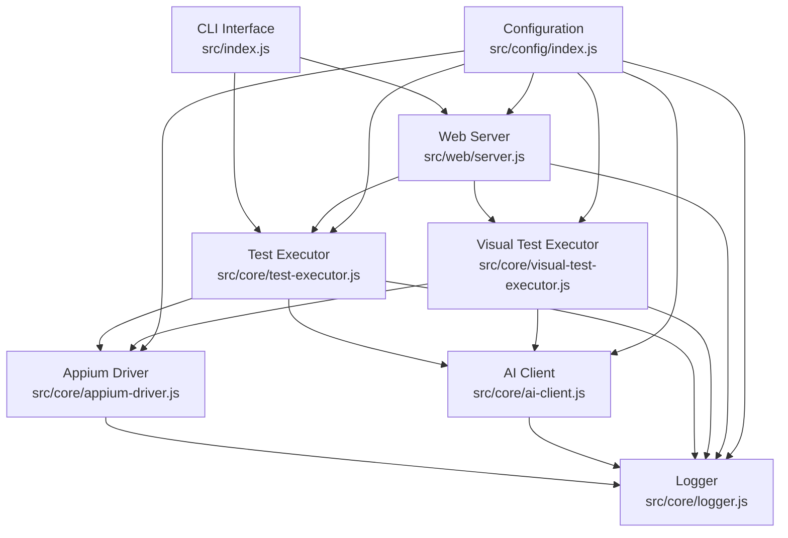

# Budsy Testing Agent - Documentation

## Overview
Comprehensive documentation for the Budsy Testing Agent, an AI-powered UI testing framework using Appium with screenshot verification capabilities.

## Project Structure

```
budsy-testing-agent/
├── src/
│   ├── config/         # Configuration management
│   ├── core/           # Core testing components
│   ├── web/            # Web interface server
│   └── index.js        # Main CLI entry point
├── scripts/            # Setup and utility scripts
└── documentation/      # This documentation
```

## Documentation Index

### Core Components

#### Configuration & Setup
- **[Package Configuration](./package.md)** - Project dependencies and scripts
- **[Setup Script](./scripts/setup.md)** - Automated project setup and configuration
- **[Configuration Management](./src/config/index.md)** - Central configuration system

#### Core Testing Engine
- **[Logger System](./src/core/logger.md)** - Centralized logging with multiple outputs
- **[AI Client](./src/core/ai-client.md)** - AI backend communication for visual analysis
- **[Appium Driver Manager](./src/core/appium-driver.md)** - WebDriver management with coordinate-based actions
- **[Test Executor](./src/core/test-executor.md)** - Traditional selector-based test execution
- **[Visual Test Executor](./src/core/visual-test-executor.md)** - AI-guided visual testing with coordinate actions

#### User Interfaces
- **[CLI Interface](./src/index.md)** - Command-line interface and interactive mode
- **[Web Interface Server](./src/web/server.md)** - Real-time web interface with WebSocket support

## Key Features

### AI-Powered Testing
- **Visual Recognition** - Screenshot-based element detection
- **Natural Language Processing** - Convert human instructions to test steps
- **Intelligent Verification** - AI-powered result validation
- **Adaptive Actions** - Self-healing coordinate-based interactions

### Multi-Platform Support
- **Web Browsers** - Chrome, Firefox, Safari, Edge
- **Android Applications** - Native and hybrid app testing
- **iOS Applications** - Native app testing with XCUITest

### Testing Modes

#### Traditional Testing (`TestExecutor`)
- CSS selector and XPath-based element interaction
- Suitable for stable, well-structured applications
- Fast execution with direct DOM access

#### Visual Testing (`VisualTestExecutor`)  
- AI-guided coordinate-based actions
- Screenshot analysis for element detection
- Resilient to UI changes and dynamic content

#### Iterative Testing
- AI session management with feedback loops
- Automatic progress assessment
- Self-guided test completion detection

### Real-Time Interface
- **WebSocket Communication** - Live test execution monitoring
- **Interactive Test Management** - Start, stop, and monitor tests
- **Log Streaming** - Real-time logging with filtering
- **Archive Generation** - Downloadable test logs and screenshots

## Component Relationships



## Import Relationships

### Configuration Flow
All components import and use `src/config/index.js` for:
- Backend AI service configuration
- Appium server settings
- Screenshot and logging preferences
- Timeout and retry configurations

### Logging Integration
Components use `src/core/logger.js` for:
- Structured logging with levels
- Console and file output
- Component-specific log formatting
- Real-time WebSocket log streaming (web interface)

### AI Integration
AI-powered components use `src/core/ai-client.js` for:
- Screenshot verification
- Visual action guidance
- Test step generation
- Iterative feedback processing

### WebDriver Management
Test executors use `src/core/appium-driver.js` for:
- Browser and mobile driver initialization
- Coordinate-based actions
- Screenshot capture
- Element interaction

## Getting Started

### Prerequisites
1. **Node.js** >= 18.0.0
2. **Appium Server** for mobile/web automation
3. **Backend AI Service** for visual analysis

### Quick Setup
```bash
# Install dependencies
npm install

# Run setup script
npm run setup

# Start interactive test
npm start

# Or start web interface
npm run web
```

### Configuration
The setup script (`scripts/setup.js`) will guide you through:
- Backend AI service configuration
- Appium server setup
- Browser preferences
- Screenshot and logging settings

## Usage Examples

### CLI Testing
```bash
# Interactive mode
budsy test

# Direct command
budsy run --url "https://example.com" --instruction "Login with test credentials"

# Web interface
budsy web --port 3000
```

### API Usage
```javascript
import VisualTestExecutor from './src/core/visual-test-executor.js';

const executor = new VisualTestExecutor();
await executor.initialize({ platform: 'web' });

const result = await executor.executeVisualTest(
  'Navigate to login page and sign in with valid credentials',
  'https://app.example.com'
);
```

## Architecture Highlights

### Modular Design
- **Separation of Concerns** - Clear boundaries between components
- **Dependency Injection** - Configuration and logging injected into components
- **Interface Consistency** - Common patterns across all modules

### Error Handling
- **Graceful Degradation** - Fallback strategies for AI failures
- **Comprehensive Logging** - Detailed error context and stack traces
- **Resource Cleanup** - Proper cleanup of WebDriver sessions and resources

### Performance Optimization
- **Coordinate Precision** - Sub-pixel accurate actions
- **Screenshot Optimization** - Efficient image handling and storage
- **Concurrent Execution** - Non-blocking test execution
- **Memory Management** - Proper resource cleanup and garbage collection

## Testing Strategies

### When to Use Traditional Testing
- Stable application with consistent selectors
- Well-structured HTML with reliable IDs/classes
- Fast execution requirements
- Regression testing of known elements

### When to Use Visual Testing
- Dynamic UIs with changing layouts
- Applications with complex styling
- Cross-browser compatibility testing
- Applications with canvas or SVG elements
- Legacy applications without reliable selectors

### When to Use Iterative Testing
- Complex workflows with multiple pages
- Exploratory testing scenarios
- Testing with uncertain outcomes
- Adaptive testing based on UI state

## File Documentation Links

### Setup and Configuration
- [Package Configuration](./package.md)
- [Setup Script](./scripts/setup.md)
- [Configuration Management](./src/config/index.md)

### Core Components
- [Logger System](./src/core/logger.md)
- [AI Client](./src/core/ai-client.md)
- [Appium Driver Manager](./src/core/appium-driver.md)
- [Test Executor](./src/core/test-executor.md)
- [Visual Test Executor](./src/core/visual-test-executor.md)

### User Interfaces
- [CLI Interface](./src/index.md)
- [Web Interface Server](./src/web/server.md)

## Contributing
When modifying components:
1. Update relevant documentation files
2. Maintain import relationship consistency
3. Follow existing logging patterns
4. Preserve error handling strategies
5. Update configuration documentation as needed

## Support
For issues and questions:
- Review component-specific documentation
- Check configuration settings
- Examine log files for detailed error information
- Verify AI backend and Appium server connectivity